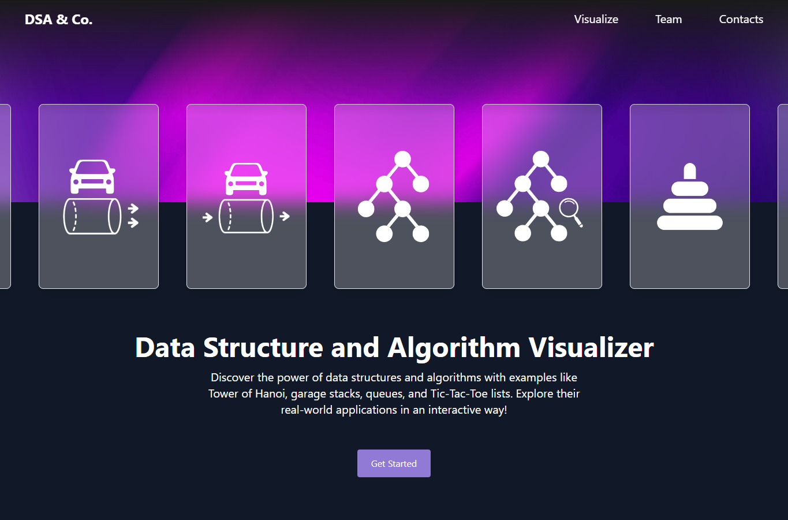

# DSA 7 Cases Study

[](https://github.com/Ramenagii/DSA-7Cases-Study/actions/workflows/ci.yml)

Interactive React/Vite coursework app for explaining data structures, algorithms, and small logic games through visual demos.



## Included Cases

- Stack simulation
- Queue simulation
- Binary tree visualization
- Binary search tree visualization
- Sorting visualizer
- Towers of Hanoi
- Tic-tac-toe logic demo

## Tech Stack

- React
- Vite
- Tailwind CSS
- Framer Motion
- D3
- Three.js

## Run Locally

```bash
npm install
npm run dev
```

## Build

```bash
npm run lint
npm run build
```

## Quality Gate

GitHub Actions runs install, audit, lint, and production build checks on pushes and pull requests.

## Project Notes

The app includes media assets for the presentation-style landing page and interactive case screens. Keep large media compressed before committing so the repository stays practical to clone.
